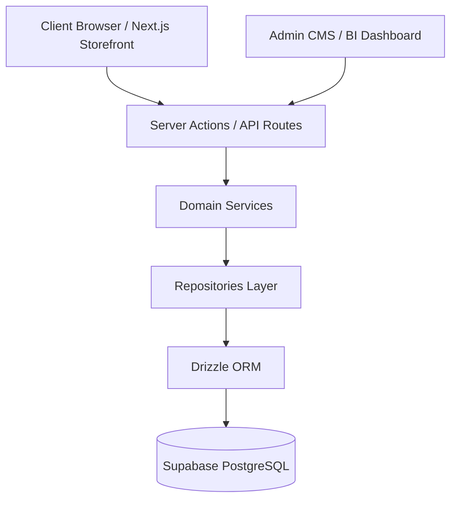

# XINVORA System Architecture Overview

## Overview
XINVORA is built on Next.js 16 (App Router) using React 19, TypeScript, Drizzle ORM, and Supabase PostgreSQL. The architecture enforces strict data access boundaries separating transactional commerce operations from domain services, data repositories, privacy compliance (CMP), and customer analytics (CDP).

---

## Architectural Principles
1. **Server Action Write Boundary**: `Server Action` ➔ `Service` ➔ `Repository` / `Drizzle`.
2. **Server Component Read Boundary**: `Server Component` ➔ `Repository` / `Drizzle`.
3. **Domain Separation**: Four distinct domains (Customer Experience, Privacy CMP, Analytics CDP, Admin BI).
4. **Privacy-First**: HMAC signed cookies, SHA-256 IP hashing, policy snapshot versioning.
5. **Non-Blocking Analytics**: In-memory event queue with batch flushing.

---

**Last Updated**: July 20, 2026
