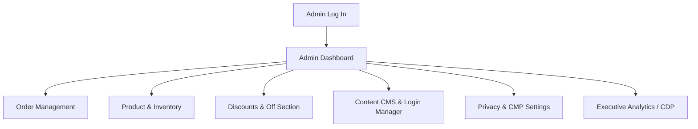

# Complete Admin & Management Journey

This guide explains how store managers and admins manage XINVORA through the Admin Panel (`/admin`).

---

## Admin Modules Overview

### 1. Dashboard (`/admin`)
- **Key Metrics**: Daily revenue, order volume, new customers, average order value.
- **Recent Orders Table**: Quick view of newest incoming orders requiring fulfillment.

### 2. Orders (`/admin/orders`)
- **Fulfillment Pipeline**: Update order status (`PENDING` -> `PROCESSING` -> `SHIPPED` -> `DELIVERED`).
- **Invoice Printing**: Print clean branded packing slips and customer invoices (`/admin/orders/print`).

### 3. Products & Inventory (`/admin/products`)
- **Catalog Editor**: Create or edit products, set names, descriptions, categories, and colors.
- **Stock Management**: Set inventory counts per size variant. When stock reaches 0, the store automatically shows a sold-out line on the storefront.

### 4. Content CMS (`/admin/cms/homepage` & `/admin/cms/login`)
- **Homepage Builder**: Change banner images, hero copy, featured collections, and promotional blocks without code changes.
- **Login & Register Manager**: Customize editorial split background images and inspirational quotes shown to signing-in customers.

### 5. Privacy & Cookie Consent (`/admin/settings/privacy`)
- **Policy Version Publisher**: Publish new privacy policy versions (forces automatic consent prompt for customers).
- **Script Registry Feature Flags**: Toggle Google Analytics, Meta Pixel, or Clarity scripts on/off dynamically.
- **Audit Logs & Export**: Download audit logs in CSV or JSON format for legal compliance.

### 6. Executive Analytics Dashboard (`/admin/cdp`)
- **Revenue Overview**: Gross vs net revenue line charts.
- **Conversion Funnel**: Track customer drop-off from Homepage -> Product -> Cart -> Checkout.
- **Search Intelligence**: View top search terms entered by customers to guide inventory purchases.

---

**Last Updated**: July 20, 2026
