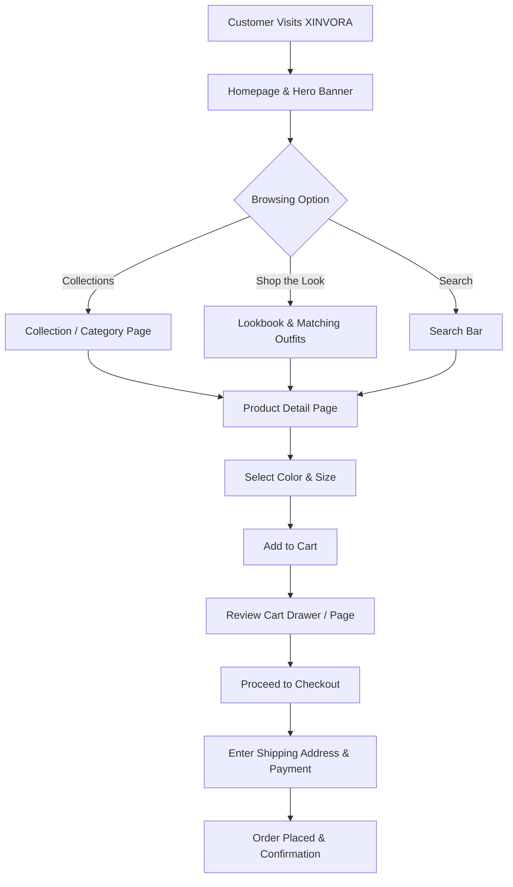

# Complete Customer User Journey

This guide describes the complete step-by-step path a customer takes when visiting XINVORA.

---

## Step-by-Step Breakdown

### 1. Landing on Homepage
- **Hero Banner**: Displays seasonal editorial photography and brand campaign messaging.
- **Privacy Banner**: A luxury floating banner appears asking for cookie consent preferences.

### 2. Discovering Products
- **Collections & Categories**: Customers browse items by category (such as Dresses, Bags, Outerwear).
- **Shop the Look**: Customers view editorial outfits and click interactive pins to buy matching pieces.

### 3. Product Selection
- **Product Detail Page (PDP)**: Customers view high-resolution images, read dress descriptions, and inspect size guides.
- **Out of Stock Line-Through**: Sold-out sizes display a single diagonal strike-through line so customers immediately know availability.

### 4. Shopping Cart
- **Discount Badges**: Items on sale display original price strikethroughs and percentage off discount badges.
- **Inline Size Swapper**: Customers can switch sizes directly inside the cart without returning to the product page.
- **Recommendations ("YOU MAY ALSO LOVE")**: Displays curated matching dresses at the bottom of the cart.

### 5. Checkout & Confirmation
- **Nepal Shipping Address**: Customers select Province, District, and Municipality for local delivery.
- **Payment Method**: Select Cash on Delivery (COD) or Online Bank Transfer / eSewa.
- **Order Confirmation**: Customer receives a confirmation order summary.

---

**Last Updated**: July 20, 2026
