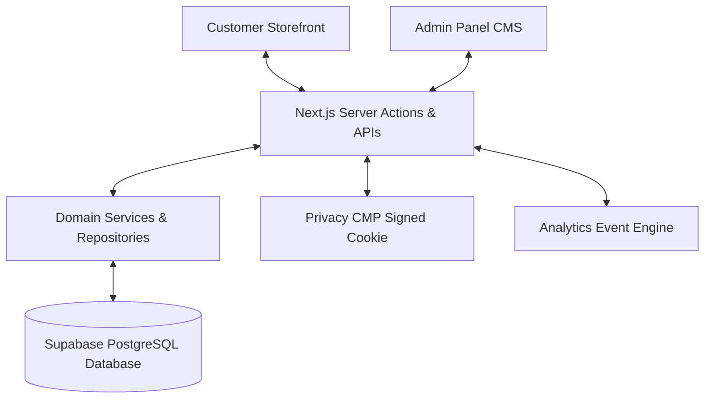

# How Everything Connects (System Integration)

This document shows how all major parts of XINVORA connect and exchange information in plain English.

---

## Component Roles & Data Flow

1. **Customer Storefront (`/`, `/products`, `/cart`)**:
   - Renders fast responsive pages.
   - Communicates with Server Actions for adding to cart, placing orders, and updating privacy settings.

2. **Admin Panel (`/admin`)**:
   - Used by store managers to control products, inventory, coupons, homepage content, and privacy policies.

3. **Privacy CMP System (`/api/cookies/consent`)**:
   - Manages signed browser cookies (`xinvora-consent`).
   - Ensures tracking scripts (GA, Meta Pixel) load only when permission is granted.

4. **Analytics CDP System (`/api/analytics/track`)**:
   - Batches non-blocking customer events in an in-memory queue.
   - Calculates executive business statistics for the admin dashboard.

5. **PostgreSQL Database**:
   - The centralized secure database where all products, users, orders, inventory, and policy snapshots are safely stored.

---

**Last Updated**: July 20, 2026
